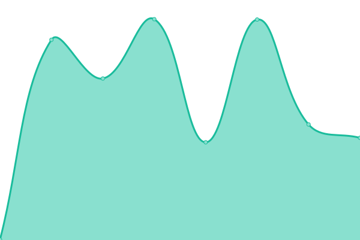

# 📈 Live Status: <!--live status--> **🟩 All systems operational**

<!--start: status pages-->
<!-- This summary is generated by Upptime (https://github.com/upptime/upptime) -->
<!-- Do not edit this manually, your changes will be overwritten -->
<!-- prettier-ignore -->
| URL | Status | History | Response Time | Uptime |
| --- | ------ | ------- | ------------- | ------ |
|  [google](https://google.gr) | 🟩 Up | [google.yml](https://github.com/panaris/uptime/commits/HEAD/history/google.yml) | 

 319ms
     
 | 

<a href="https://panaris.github.io/uptime/history/google">100.00%</a>
    

<!--end: status pages-->

[**Visit my status website →**](https://panaris.github.io/uptime/)
